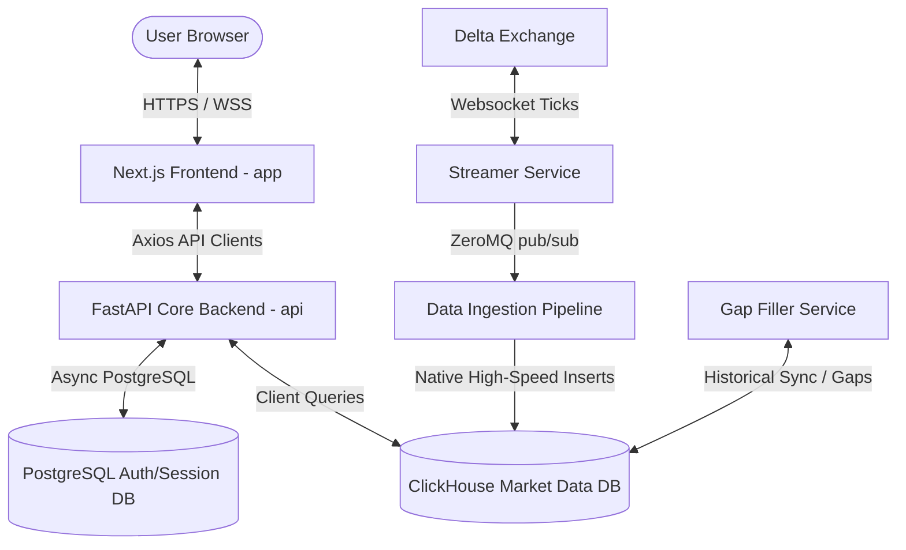

# CrypAlgos Frontend - Architectural Blueprint

This document details the architectural landscape, directory structure, data-flow vectors, and state-management schemas of the CrypAlgos Next.js application. It is designed to act as the single source of truth for both developers and future autonomous AI coding agents.

---

## 🧭 High-Level Ecosystem Layout

The frontend application (`app`) acts as the user-facing command center of the CrypAlgos quant ecosystem. It orchestrates real-time quantitative visualizers, strategy builders, and pre-launch management consoles by coordinating with multiple backend subsystems:



---

## 📂 Core Folder Anatomy & App Routing

We utilize the Next.js **App Router** paradigm to partition concerns, optimize code splitting, and build robust public, authentication, and core trading layers.

```
app/
├── src/
│   ├── api-actions/    # Domain-specific async Axios API namespaces (e.g., session-actions.ts)
│   │   └── hooks/      # Shared React Query hooks files (e.g., session-hooks.ts)
│   ├── app/            # App Router entrypoints, styles, and middleware
│   │   ├── (auth)/     # Private authentication screens (Login, Registration, OTP Verification)
│   │   ├── (dashboard)/# Trading, portfolio metrics, real-time quant analysis
│   │   ├── (public)/   # Public marketing, contact form, priority waitlist page
│   │   └── (strategy-builder)/ # Drag-and-drop strategy node canvas & editor
│   ├── components/     # UI elements (Modular custom primitives, Shadcn + KokonutUI)
│   │   ├── kokonutui/  # Curated premium interactive animations and cards
│   │   └── ui/         # Primitives (Radix and basic inputs)
│   ├── constants/      # App-wide fixed config, symbol pools, API structures
│   ├── hooks/          # Shared reactive custom React hooks (e.g. mobile detection)
│   ├── lib/            # Utility functions, Axios interceptors, provider setup
│   ├── schema/         # Client-side validation schemas (Zod input structures)
│   ├── store/          # Lightweight global state orchestrators (Zustand stores)
│   └── types/          # Strict TypeScript contract definitions & interfaces
```

### Route Groups Taxonomy

By leveraging route groups (folders enclosed in parentheses `( )`), we encapsulate layout-specific middleware and styles without modifying URL paths:

| Route Group | Scope / Purpose | Key Features |
| :--- | :--- | :--- |
| `(public)` | Marketing & pre-launch user collection. | Outfits typography, floating waitlist joining card, asynchronous contact forms. |
| `(auth)` | Secure authorization workflows. | OTP validation controls, Google Social Login integration, JWT cookie bindings. |
| `(dashboard)`| Core performance visualizer. | Portfolio trackers, interactive Recharts curves, live position monitoring. |
| `(strategy-builder)` | Quantitative engine creation console. | Dynamic canvas with `@xyflow/react`, code syntax compilation using Monaco Editor. |

---

## 🔄 State-Management Hierarchy

To scale seamlessly and avoid component re-render thrashing, we classify state into three strict layers:

```
┌────────────────────────────────────────────────────────────────────────┐
│                              CLIENT STATE                              │
│                                                                        │
│  [Zustand Store]                                                       │
│  Scope: Lightweight, highly-reactive persistent actions (Auth session, │
│         loading gates, user profile, active UI sidebar toggles).        │
└───────────────────────────────────┬────────────────────────────────────┘
                                    │
┌───────────────────────────────────▼────────────────────────────────────┐
│                              SERVER STATE                              │
│                                                                        │
│  [@tanstack/react-query]                                               │
│  Scope: Dynamic, cached API data. Synchronizes, auto-refreshes,        │
│         and deduplicates network queries across concurrent components.  │
└───────────────────────────────────┬────────────────────────────────────┘
                                    │
┌───────────────────────────────────▼────────────────────────────────────┐
│                             ROUTER / URL STATE                         │
│                                                                        │
│  [nuqs (Next.js URL Query State)]                                      │
│  Scope: Search patterns, tabular page indices, active filters.         │
│         Keeps address bar in sync to enable direct link sharing.       │
└────────────────────────────────────────────────────────────────────────┘
```

### 1. Client State (Zustand)
- We use **Zustand** rather than heavy Redux configurations. It is lightweight, non-boilerplate, and operates outside the React component render loop when values do not change.
- **Example**: `auth-store.ts` coordinates standard authentication states:
```typescript
interface AuthStore {
  isAuthenticated: boolean;
  user: IUser | null;
  isLoading: boolean;
  setLogin: (data: ILoginResponse) => void;
  setLogout: () => void;
}
```

### 2. Server State (React Query)
- All network fetches to the FastAPI backend that require caching or structural validation must leverage `@tanstack/react-query`.
- **Conventions**:
  - Never trigger bare Axios calls inside raw user actions. Wrap them in standardized custom query hooks.
  - Configure robust `staleTime` and `gcTime` limits to prevent spamming backend services.

### 3. URL Query State (`nuqs`)
- Any operational UI state (e.g. searching waitlists, paginating contacts) should be stored in the URL.
- **Benefit**: Flawless page refreshes, direct sharing of exact workspace states, and zero-sync React hooks overhead.

---

## 🔒 Security & Session Middleware

The application employs Next.js edge-based `middleware.ts` to inspect requests before they reach Next.js Page components:
1. **JWT Verification**: Extracts the `token` cookie stored via `cookies-next`.
2. **Access Control List (ACL)**:
   - Restricts `/dashboard/*` and `/strategy-builder/*` to authenticated accounts.
   - Redirects authenticated users away from `/login` or `/register` to prevent redundant authentication flows.
3. **Admin Verification**: Coexists with the main FastAPI bearer interceptor to gracefully kick out non-allowed profiles.

---

## 🤖 The `.agents` Folder & Modular Skills Architecture

To eliminate the need for repeated manual developer hand-holding or AI knowledge transfer (KT), the repository integrates the open agent skills ecosystem inside the **`.agents`** folder at the application root.

This directory serves as the localized repository of specialized agent intelligence, automated design scripts, templates, and workspace directives.

### 1. Structural Overview
```
app/
├── .agents/
│   └── skills/
│       ├── find-skills/                  # CLI skill to search the global registry
│       │   └── SKILL.md                  # Defines keywords, triggers, and CLI commands
│       ├── frontend-design/              # Custom design constraints for high-fidelity assets
│       ├── shadcn/                       # Automated Shadcn component generation workflows
│       └── vercel-react-best-practices/  # React 19 / Next.js 16 compiler optimization guides
├── skills-lock.json                      # Version locked metadata for all installed modular skills
└── AGENTS.md                             # Global agent directives and workspace integration mapping
```

### 2. Discoverability & Triggers
Every folder inside `.agents/skills/` contains a **`SKILL.md`** file. The metadata header defines the skill's name, description, capabilities, and triggering conditions:

```markdown
---
name: vercel-react-best-practices
description: Core performance tuning tips, server component layouts, and hooks execution parameters.
---
```

When an AI coding agent starts a session or tackles a task (e.g. optimizing heavy charts or styling a page), it automatically parses `.agents/` and active skills to align its execution with installed guidelines.

### 3. The Skills CLI (`npx skills`)
Developers and agents interact with the modular skills ecosystem using the Skills CLI package manager:

| Command | Scope | Purpose |
| :--- | :--- | :--- |
| `npx skills find <query>` | Discover | Searches the global agent skills registry (e.g., `npx skills find tailwind`) |
| `npx skills add <package>` | Install | Adds a modular skill package from GitHub or other sources to `.agents/skills/` |
| `npx skills check` | Audit | Verifies installed skills against locking version sheets |
| `npx skills update` | Upgrade | Syncs all installed skills to their latest releases |

By utilizing localized, standardized skills, CrypAlgos keeps its quant-visualizer developer guides completely unified and automatically accessible to any automated workflow.
