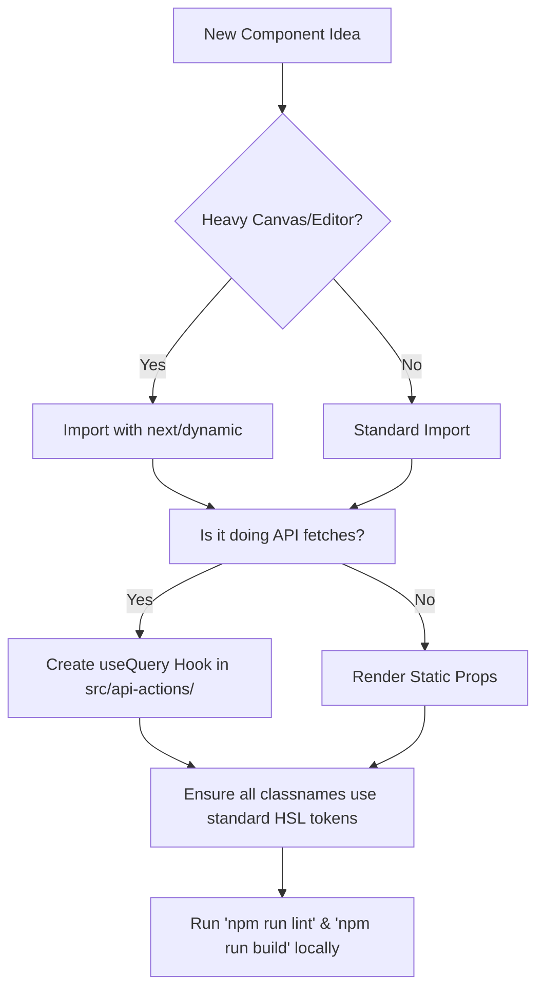

# CrypAlgos Frontend - Best Practices Checklist (Do's & Don'ts)

To maintain our code standard, prevent regressions, and ensure that our visual interface feels responsive, secure, and clean, all developers and AI agents must follow this checklist of core architectural practices.

---

## 🟢 DO'S (Good Practices)

### 1. TypeScript & Strict Contracts
* **Use Explicit Typing**: Define complete, detailed interfaces for all API payloads and visual component properties.
* **Avoid `any`**: The use of `any` defeats the purpose of static type checking. Use `unknown` or specific custom types.
* **Zod Schemas**: Back all client forms (using `react-hook-form`) with custom Zod schemas located inside `src/schema/` for centralized client-side payload validation.

### 2. State & URL Synchronization
* **Leverage `nuqs` for Filtering and Pagination**: Synchronize current search parameters, dashboard tabs, sorting keys, and lists directly in the address bar. This ensures clean reloads and makes direct links easily shareable.
* **Invalidate Query Cache Dynamically**: After successful mutations (such as deleting a user session or updating waitlists), explicitly trigger `queryClient.invalidateQueries` to synchronize UI states with server structures without full page refreshes.

### 3. Component Design & Interactivity
* **Premium UX & Responsive Layouts**: Utilize modern layout engines (Flexbox, Grid), Outfits/Inter typography, harmonious gradients, glassmorphism, and responsive breakpoints. Ensure all interactive custom cards have elegant `:hover` transitions and micro-animations.
* **Access Control with Next.js Middleware**: Leverage `middleware.ts` for all route gating, checking authorization states via secure HttpOnly session cookies before components load.

### 4. API & Network Protocol
* **Use Axios Interceptors**: Always leverage the pre-configured base Axios instance (`src/lib/axios-interceptor.ts`). It automatically attaches JWT Authorization headers, handles token expiration, and executes automatic redirection on authorization failure.
* **Unique testability IDs**: Ensure all form inputs, CTA buttons, and interactive cards have unique, descriptive `id` properties for testing pipelines.

---

## 🔴 DON'TS (Bad Practices)

### 1. Hardcoded Values & Visual Magic
* **No Direct Hex Codes**: Never apply arbitrary Hex colors (e.g. `#1a1a1a` or `text-[#bf9f5f]`) in component files. Always reference the core stylesheet HSL tokens (`bg-background`, `border-border`, `text-primary`).
* **No synthetic delays or mocks in Production**: Mocks should only exist inside testing environments. The production frontend must render dynamic server data, displaying clean loaders (`Loader2` or skeleton panels) during request phases.

### 2. Inefficient Rendering & Heavy Splitting
* **No Static Imports of Heavy Modules**: Do not statically import massive visual or compilation assets like React Flow and Monaco Editor at the layout root. Always lazy load them utilizing Next.js `next/dynamic`.
* **Do Not Nest State in Layouts**: Avoid setting global React state for values that are local to a specific page or dashboard tab. Keep state as low in the tree as possible to avoid redundant component re-rendering.

### 3. Sub-optimal Network Flows
* **No Raw `axios.get` calls inside client effects**: Using un-cached raw Axios requests inside user effects triggers duplicate execution on every render cycle. Always wrap network queries inside React Query (`@tanstack/react-query`) hooks.
* **No Duplicate state caches**: Never sync cached React Query data manually into local Zustand states. Leverage Query's native cache and local Selectors to retrieve values.

---

## 📝 Practice Verification Flow

When implementing a new feature, run this checklist:

